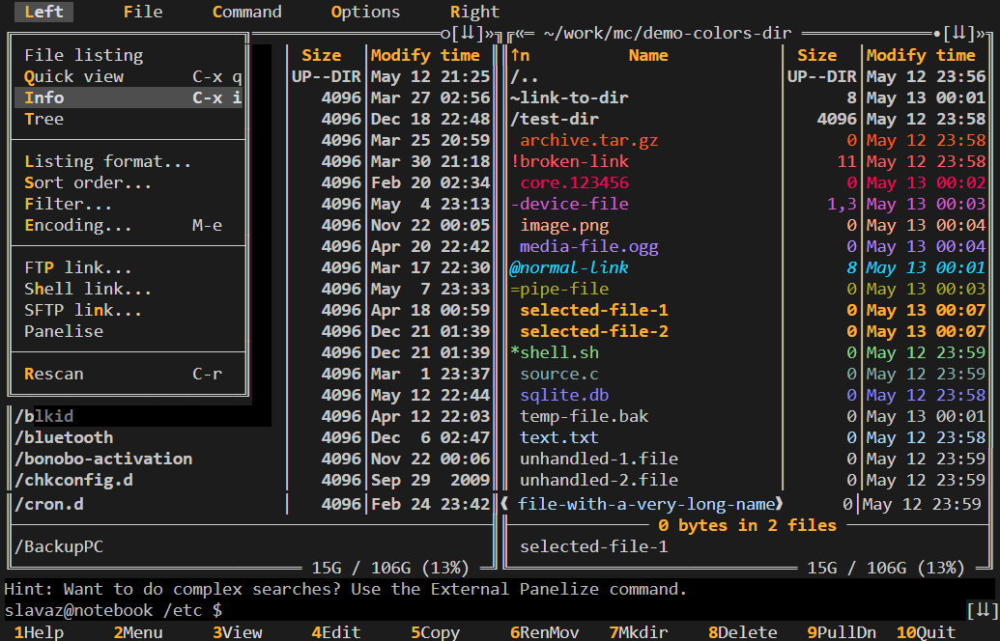
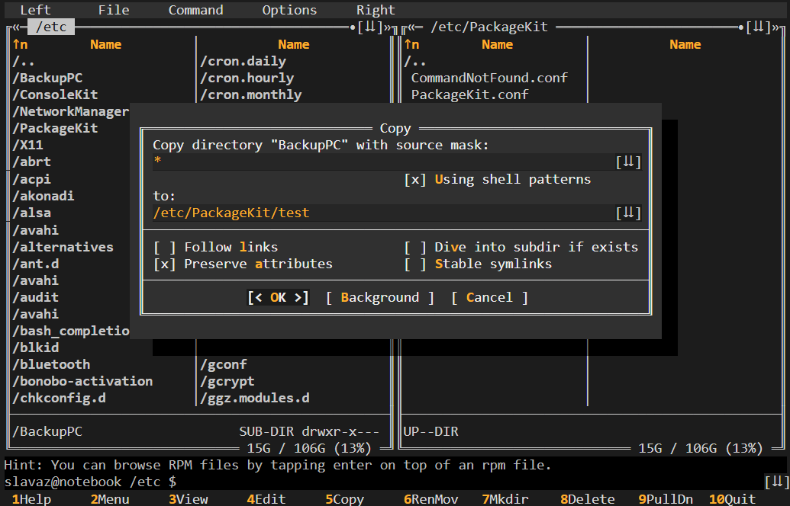
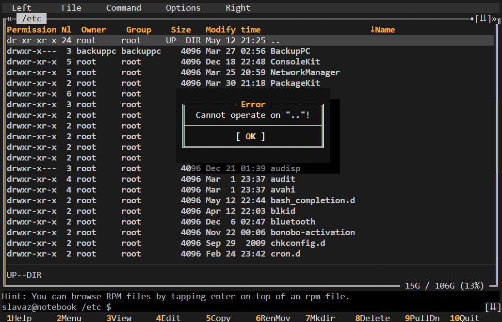
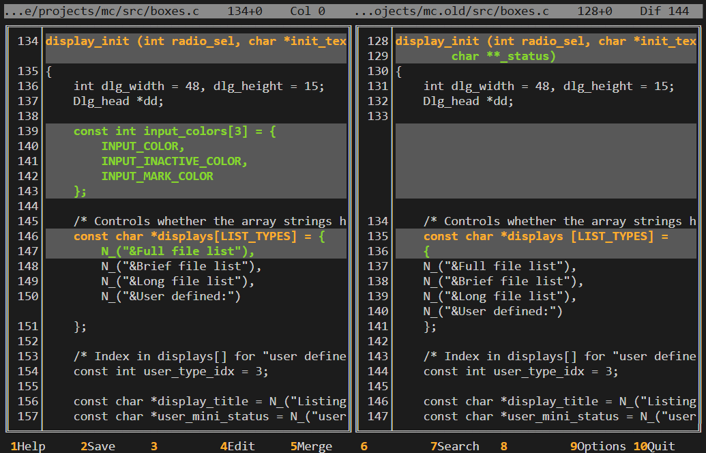

# Amber Midnight Commander Skin

Save to `/usr/share/mc/skins/amber.ini`







```ini
[skin]
    description = MoDarIn256root (root)
    256colors = true

[Lines]
    horiz = ─
    vert = │
    lefttop = ┌
    righttop = ┐
    leftbottom = └
    rightbottom = ┘
    topmiddle = ┬
    bottommiddle = ┴
    leftmiddle = ├
    rightmiddle = ┤
    cross = ┼
    dhoriz = ═
    dvert = ║
    dlefttop = ╔
    drighttop = ╗
    dleftbottom = ╚
    drightbottom = ╝
    dtopmiddle = ╤
    dbottommiddle = ╧
    dleftmiddle = ╟
    drightmiddle = ╢

[core]
    _default_ = color252;color234
    selected = color254;color238
    marked = color214;;bold
    markselect = color228;color88;bold
    gauge = color250;color95
    input = color214;color235;
    inputmark = color228;color88;bold
    inputunchanged = color214;color235;italic
    commandlinemark = color228;color88;bold
    reverse = color233;color251
    header = color214;;bold
    disabled = color246;color239
    #inputhistory =
    #commandhistory =
    shadow = color243;color0

[dialog]
    _default_ = color255;color236
    dhotnormal = color214;;bold
    dfocus = color255;color234;bold
    dhotfocus = color214;;bold
    dtitle = color180;;bold

[error]
    _default_ = color255;color233
    errdfocus = color255;color233;bold
    errdhotnormal = color203;color52
    errdhotfocus = color214;color233;bold
    errdtitle = color214;;bold

[filehighlight]
    directory = color251;;bold
    executable = color114
    symlink = color45;;italic
    hardlink =
    stalelink = color203
    device = color170
    special = color142
    core = color197
    temp = color251
    archive = color202
    doc = color153
    source = color109
    media = color141
    graph = color216
    database = color105

[menu]
    _default_ = color252;color234
    menusel = color253;color239;bold
    menuhot = color214;;bold
    menuhotsel = color214;color239;bold
    menuinactive = color253;color236

[popupmenu]
    _default_ = color252;color239
    menusel = color253;color88
    menutitle = color180;;bold

[buttonbar]
    button = color253;color234
    hotkey = color214;color234;bold

[statusbar]
    _default_ = color233;color245

[help]
    _default_ = color252;color239
    helpitalic = color114;;bold
    helpbold = color180;;bold
    helplink = color45
    helpslink = color228;color88;bold
    helptitle = color180;;bold

[editor]
    _default_ = color252;color45
    editbold = color172;;bold
    editmarked = color228;color172;bold
    editwhitespace = color148;color234
    editnonprintable = ;black
    editlinestate = color178;color235
    bookmark = ;color239
    bookmarkfound = ;color239;bold
    editrightmargin = ;color235;bold

[viewer]
    _default_ = color252;color237
    viewbold = ;;bold
    viewunderline = ;;underline
    viewselected = color228;color88;bold

[diffviewer]
    changedline = color214;color240;bold
    changednew = color148;color240;bold
    changed = color214;color240;bold
    added = color148;color240;bold
    removed = color255;color240;bold
    error = color255;233;bold

[widget-panel]
    sort-up-char = ↑
    sort-down-char = ↓
    hiddenfiles-show-char = •
    hiddenfiles-hide-char = ○
    history-prev-item-char = «
    history-next-item-char = »
    history-show-list-char = ⇊
    filename-scroll-left-char = ❰
    filename-scroll-right-char = ❱

[widget-scrollbar]
    up-char = ▲
    down-char = ▼
    left-char = ◀
    right-char = ▶
    thumb-char = ■
    track-char = ▒

[widget-editor]
    window-state-char = ↕
    window-close-char = ✕
```
